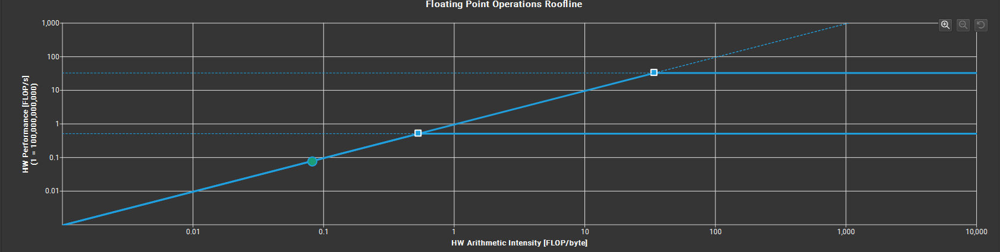

### CUDA Basic

https://en.wikipedia.org/wiki/CUDA#GPUs_supported

| CUDA SDK Version  |    Tesla    | Fermi | Kepler (Early) | Kepler (Late) | Maxwell | Pascal |   Volta   | Turing | Ampere | Ada Lovelace | Hopper | Blackwell |
|:------------------|:-----------:|:-----:|:--------------:|:-------------:|:-------:|:------:|:---------:|:------:|:------:|:------------:|:------:|:---------:|
| **1.0**           |  1.0 – 1.1  |       |                |               |         |        |           |        |        |              |        |           |
| **1.1**           | 1.0 – 1.1+x |       |                |               |         |        |           |        |        |              |        |           |
| **2.0**           | 1.0 – 1.1+x |       |                |               |         |        |           |        |        |              |        |           |
| **2.1 – 2.3.1**   |  1.0 – 1.3  |       |                |               |         |        |           |        |        |              |        |           |
| **3.0 – 3.1**     |     1.0     |  2.0  |                |               |         |        |           |        |        |              |        |           |
| **3.2**           |     1.0     |  2.1  |                |               |         |        |           |        |        |              |        |           |
| **4.0 – 4.2**     |     1.0     |  2.1  |                |               |         |        |           |        |        |              |        |           |
| **5.0 – 5.5**     |     1.0     |       |      3.0       |      3.5      |         |        |           |        |        |              |        |           |
| **6.0**           |     1.0     |       |      3.2       |      3.5      |         |        |           |        |        |              |        |           |
| **6.5**           |     1.1     |       |                |      3.7      |   5.x   |        |           |        |        |              |        |           |
| **7.0 – 7.5**     |             |  2.0  |                |               |   5.x   |        |           |        |        |              |        |           |
| **8.0**           |             |  2.0  |                |               |         |  6.x   |           |        |        |              |        |           |
| **9.0 – 9.2**     |             |       |      3.0       |               |         |        | 7.0 – 7.2 |        |        |              |        |           |
| **10.0 – 10.2**   |             |       |      3.0       |               |         |        |           |  7.5   |        |              |        |           |
| **11.0**          |             |       |                |      3.5      |         |        |           |        |  8.0   |              |        |           |
| **11.1 – 11.4**   |             |       |                |      3.5      |         |        |           |        |  8.6   |              |        |           |
| **11.5 – 11.7.1** |             |       |                |      3.5      |         |        |           |        |  8.7   |              |        |           |
| **11.8**          |             |       |                |      3.5      |         |        |           |        |        |     8.9      |  9.0   |           |
| **12.0 – 12.6**   |             |       |                |               |   5.0   |        |           |        |        |              |  9.0   |           |
| **12.8**          |             |       |                |               |   5.0   |        |           |        |        |              |        |   12.0    |
| **12.9**          |             |       |                |               |   5.0   |        |           |        |        |              |        |   12.1    |
| **13.0**          |             |       |                |               |         |        |           |  7.5   |        |              |        |   12.1    |

### setup environment:

CMAKE:

CUDA TOOLKIT: https://developer.nvidia.com/cuda/toolkit
Set up environment variables like:
CUDAToolkit_ROOT = C:/Program Files/NVIDIA GPU Computing Toolkit/CUDA/v13.1
CMAKE_CUDA_COMPILER = C:/Program Files/NVIDIA GPU Computing Toolkit/CUDA/v13.1/bin/nvcc.exe

Please download CUDNN from official sources (https://developer.nvidia.com/cudnn) and install it
Could NOT find CUDNN (missing: CUDNN_INCLUDE_DIR CUDNN_LIBRARY)
CUDNN_INCLUDE_DIR = C:\Program Files\NVIDIA\CUDNN\v9.18\include\13.1
CUDNN_LIBRARY = C:\Program Files\NVIDIA\CUDNN\v9.18\lib\13.1\x64\cudnn.lib

- set up for linux:
  export CUDAToolkit_ROOT="/usr/local/cuda-13.1"
  export CMAKE_CUDA_COMPILER="/usr/local/cuda-13.1/bin/nvcc"
  export CUDNN_INCLUDE_DIR="/usr/include/x86_64-linux-gnu"
  export CUDNN_LIBRARY="/usr/lib/x86_64-linux-gnu/libcudnn.so"
- for ncu/nsys
  export PATH="/usr/local/cuda-13.1/bin:$PATH

install mpi
- sudo apt install -y libopenmpi-dev openmpi-bin

- nvidia-smi
- check Driver Version: 582.16, and processes.
- then install
- sudo apt install nvidia-compute-utils-580
- sudo apt install nvidia-compute-utils-580-server

### vckpkg setup

git clone https://github.com/microsoft/vcpkg.git
cd vcpkg
./bootstrap-vcpkg.sh

```bash
#~/.bashrc
export PATH="$PATH:/path/to/vcpkg"
export VCPKG_ROOT=""/path/to/vcpkg"
```

- vcpkg list
- vcpkg install gtest

and set `-DCMAKE_TOOLCHAIN_FILE="D:/opt/vcpkg/scripts/buildsystems/vcpkg.cmake"`
and set `-DCMAKE_TOOLCHAIN_FILE="~/opt/vcpkg/scripts/buildsystems/vcpkg.cmake"`
and set `-DVCPKG_MANIFEST_INSTALL=OFF` if needed

### Repo init

vcpkg install

### handy commands:

- manully compile
- `nvcc add_cuda.cu -o add_cuda`
- `nvcc --arch <PTX virtual code arch version>, -code <physical machine code arch version>`

- to check gpu usage:
- `watch -n 1 nvidia-smi`
- `while ($true) { cls; nvidia-smi; Start-Sleep -Seconds 1 }`

- Nsight Compute(ncu) bash:
- sudo ${ncu} --print-details --nvtx --call-stack --set full ./add_cuda
- sudo ${ncu} --nvtx --call-stack --set full -f --export add_cuda.ncu-rep ./add_cuda
- Nsight Compute(ncu) pwsh administrator:
- & $ncu --print-details --nvtx --call-stack --set full .\cuda_poc.exe
- & $ncu --nvtx --call-stack --set full -f --export add_cuda.ncu-rep .\cuda_poc.exe
- Nsight Compute(ncu) cmd administrator:
- ncu --print-details --nvtx --call-stack --set full cuda_poc.exe
- ncu --nvtx --call-stack --set full -f --export add_cuda.ncu-rep cuda_poc.exe
- Nsight Compute(ncu) cmd administrator Roofline Chart only:
- ncu --print-details=all --section SpeedOfLight_RooflineChart cuda_poc.exe

- Test gtest (Admin):
- ncu --nvtx --call-stack --set full -f --export CudaPoc_Day0101.ncu-rep -- .\cmake-build-debug\test\test_day01.exe
  --gtest_filter=CudaPoc_Day0101.HelloCuda
- ncu --nvtx --call-stack --set full -f --export CudaPoc_Day0103.ncu-rep -- .\cmake-build-debug\test\test_day01.exe
  --gtest_filter=CudaPoc_Day0103.CompareInTypes
- ncu --nvtx --call-stack --set full -f --export CudaPoc_Day0301.ncu-rep -- .\cmake-build-debug\test\test_day01.exe
  --gtest_filter=CudaPoc_Day0301.*
- ncu --nvtx --call-stack --set full -f --export CudaPoc_Day0302.ncu-rep -- .\cmake-build-debug\test\test_day01.exe
  --gtest_filter=CudaPoc_Day0302.*
- ncu --nvtx --call-stack --set full -f --export CudaPoc_Day0401.ncu-rep -- .\cmake-build-debug\test\test_day01.exe
  --gtest_filter=CudaPoc_Day0401.*

- Test gtest cases (User):
- .\cmake-build-debug\test\test_day01.exe

- NSight System(nsys):
- nsys profile -t cuda,nvtx,osrt -o stream -f true ./stream
- nsys profile -t cuda,nvtx,osrt -o stream01 -f true ./cmake-build-debug/test/test_day05cu --gtest_filter=CudaPoc_Day0502_Stream.Stream01
- nsys profile -t cuda,nvtx,osrt -o stream02 -f true ./cmake-build-debug/test/test_day05cu --gtest_filter=CudaPoc_Day0502_Stream.Stream02
- nsys profile -t cuda,nvtx,osrt -o stream03 -f true ./cmake-build-debug/test/test_day05cu --gtest_filter=CudaPoc_Day0502_Stream.Stream03
- nsys profile -t cuda,nvtx,osrt -o stream04 -f true ./cmake-build-debug/test/test_day05cu --gtest_filter=CudaPoc_Day0502_Stream.Stream04
- nsys profile -t cuda,nvtx,osrt -o AllocateInStream01 -f true ./cmake-build-debug/test/test_day05cu --gtest_filter=CudaPoc_Day0502_Stream.AllocateInStream01
- nsys profile -t cuda,nvtx,osrt -o AllocateInStream02 -f true ./cmake-build-debug/test/test_day05cu --gtest_filter=CudaPoc_Day0502_Stream.AllocateInStream02
- nsys profile -t cuda,nvtx,osrt -o AllocateInPinMem -f true ./cmake-build-debug/test/test_day05cu --gtest_filter=CudaPoc_Day0502_Stream.AllocateInPinMem

then use Nsight system to open stream.nsys-rep


-
- Check topo structure among multiple GPUs:
- nvidia-smi topo -m

### Sample roofline chart:


